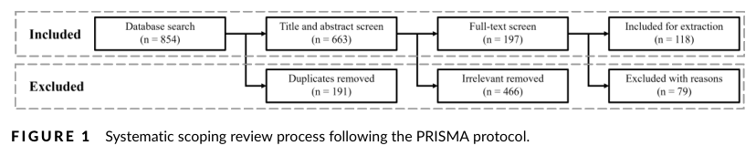

# 그림 목록 — Practical and Ethical Challenges of Large Language Models in Education: A Systematic Scoping Review

> 자동 생성(llmwiki extract). 원문 PDF 캡처 · 로컬 연구용. 캡션은 원문 그대로.

## Figure 1 (p.8)

*FIGUR E 1 Systematic scoping review process following the PRISMA protocol.*

