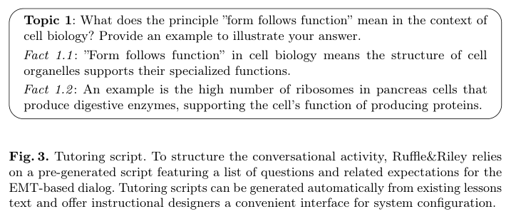
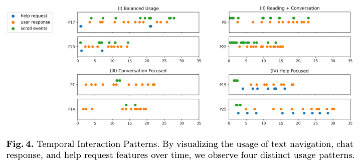

# 그림 목록 — Ruffle&Riley: Insights from Designing and Evaluating a Large Language Model-Based Conversational Tutoring System

> 자동 생성(llmwiki extract). 원문 PDF 캡처 · 로컬 연구용. 캡션은 원문 그대로.

## Figure 1 (p.3)

*Fig. 1. UI of Ruffle&Riley. (a) Learners are asked to teach Ruffle (student agent) in a free-form conversation and request help as needed from Riley (professor agent). Ruffle tries to guide the learner to articulate the expectations in the tutoring script. (b) The learner can navigate the lesson material during the conversation. (c) Ruffle encourages the learner to explain the content. (d) Riley responds to a help request. (e) Riley detected a misconception and prompts the learner to revise their response.*

## Figure 2 (p.5)

*Fig. 2. System architecture. Ruffle&Riley generates a tutoring script automatically from a lesson text by executing three separate prompts that induce questions, solutions and expectations for the EMT-based dialog. During the learning process, the script is orchestrated via two LLM-based conversational agents in a free-form dialog that follows the ITS-typical outer and inner loop structure.*

## Figure 3 (p.6)

*Fig. 3. Tutoring script. To structure the conversational activity, Ruffle&Riley relies on a pre-generated script featuring a list of questions and related expectations for the EMT-based dialog. Tutoring scripts can be generated automatically from existing lessons text and offer instructional designers a convenient interface for system configuration.*

## Figure 4 (p.10)

*Fig. 4. Temporal Interaction Patterns. By visualizing the usage of text navigation, chat response, and help request features over time, we observe four distinct usage patterns.*

