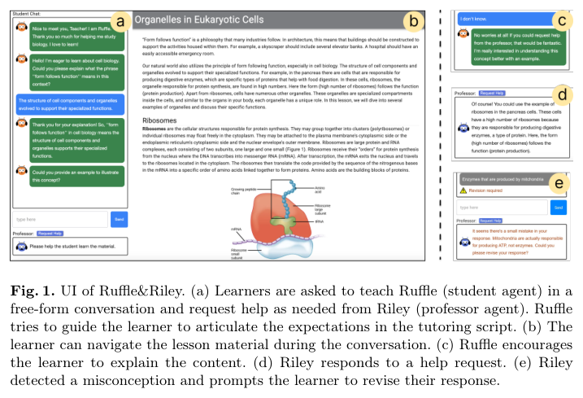
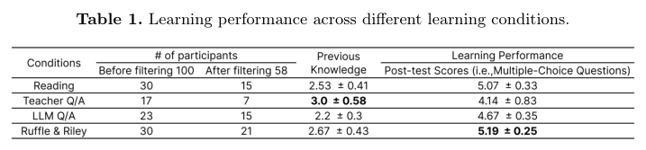
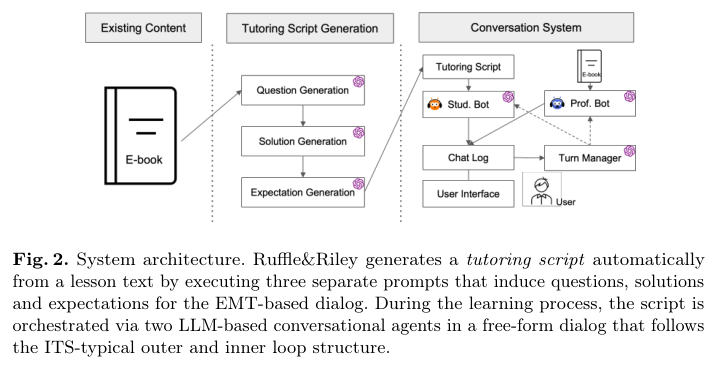

# Ruffle&Riley: Insights from Designing and Evaluating a Large Language Model-Based Conversational Tutoring System

> **저자**: Robin Schmucker, Meng Xia, Amos Azaria, Tom Mitchell | **날짜**: 2024-04-26 | **DOI**: [10.1007/978-3-031-64302-6_6](https://doi.org/10.1007/978-3-031-64302-6_6) · arXiv [2404.17460](https://arxiv.org/abs/2404.17460)
> **자료**: [추출 원문](source.md) · [그림 목록](figures/figures.md) · [표 목록](tables/tables.md) — 원문 PDF는 Zotero/로컬 보관

---

## Essence

*Fig. 1. UI of Ruffle&Riley …* — 원문 PDF 캡처 · 로컬 연구용 (arXiv CC BY 4.0)
- 무엇이 보이는가: 왼쪽 채팅 창(학생 에이전트 Ruffle·교수 에이전트 Riley), 가운데 교재(세포 소기관), 오른쪽 도움 요청·수정 요청 예시.
- 어떻게 읽을까: 학습자가 Ruffle에게 개념을 "가르치고", 막히면 Riley에게 도움을 받는 learning-by-teaching 구조다.
- 텍스트만 읽으면 놓치는 것: 교재와 대화가 한 화면에 함께 있어, 학습자가 읽기와 설명하기를 오가며 활동한다는 점.

교재 텍스트에서 질문·해답·expectation으로 이루어진 tutoring script를 GPT-4로 자동 생성하고, 이 스크립트를 학생(Ruffle)·교수(Riley) 두 LLM 에이전트가 자유 대화로 진행하는 conversational tutoring system(CTS)을 제안했다 [근거: 2024-schmucker-ruffle-riley-insights-designing · p.1]. 두 번의 온라인 사용자 연구(N=200)에서 학습 경험 평가는 높았지만 reading 대비 단기 학습 성과의 유의한 차이는 없었다 [근거: 2024-schmucker-ruffle-riley-insights-designing · p.1].

## Motivation

- **Known**: CTS는 자연어 대화로 인지적 몰입과 추론 과제 학습 성과를 높이는 것으로 알려져 있다 [근거: 2024-schmucker-ruffle-riley-insights-designing · p.2].
- **Gap**: ITS 콘텐츠 1시간을 만드는 데 수백 시간이 들 만큼 authoring 비용이 크고, 기존 CTS는 NLP 한계로 자유 대화를 일관되게 유지하기 어렵다 [근거: 2024-schmucker-ruffle-riley-insights-designing · p.2].
- **Why**: authoring 비용 때문에 ITS가 핵심 과목·큰 학습자 집단에만 집중되어 다루는 주제와 학습자 다양성이 좁아진다 [근거: 2024-schmucker-ruffle-riley-insights-designing · p.2].
- **Approach**: LLM으로 교재에서 tutoring script를 자동 유도하고, EMT(expectation misconception tailoring) 원칙을 에이전트 프롬프트에 녹여 스크립트 진행(orchestration)까지 자동화했다 [근거: 2024-schmucker-ruffle-riley-insights-designing · p.4–5].

## Achievement

*Table 1. Learning performance across different learning conditions.* — 원문 PDF 캡처 · 로컬 연구용 (arXiv CC BY 4.0)
- 무엇이 보이는가: 네 조건(Reading, Teacher Q/A, LLM Q/A, Ruffle & Riley)의 참가자 수와 post-test 점수.
- 어떻게 읽을까: Ruffle & Riley가 5.19로 가장 높지만, 본문은 one-way ANOVA에서 유의한 차이가 없다고 보고한다.
- 텍스트만 읽으면 놓치는 것: 필터링 후 조건별 인원이 7–21명으로 작고 불균형하다는 점.

1. **일관된 자유 대화 진행**: LLM이 생성한 5개 질문·17개 expectation 스크립트를 자유 대화로 진행했고, 참가자 21명 중 17명이 스크립트 전체를 마쳤다 [근거: 2024-schmucker-ruffle-riley-insights-designing · p.8].
2. **학습 경험 향상**: 세 chatbot 조건 중 R&R이 이해·기억·지원 측면에서 유의하게 더 도움이 된다고 평가받았고, 즐거움도 TQA·LQA보다 높았다 [근거: 2024-schmucker-ruffle-riley-insights-designing · p.8, Table 2].
3. **학습 성과는 차이 없음**: 1차 연구(post-test)와 2차 연구(심화 이해 문항, pre/post) 모두 reading 대비 유의한 차이를 찾지 못했다 [근거: 2024-schmucker-ruffle-riley-insights-designing · p.8; p.10, Table 3].
4. **사용 패턴과 성과의 관계**: 대화에 집중하고 도움 요청을 하지 않은 집단의 학습 향상이 가장 컸고, 설명에 쓴 단어 수·학습 시간은 성과와 양의 상관을 보였다 [근거: 2024-schmucker-ruffle-riley-insights-designing · p.11, Table 5–6].

## How

*Fig. 2. System architecture …* — 원문 PDF 캡처 · 로컬 연구용 (arXiv CC BY 4.0)
- 무엇이 보이는가: E-book → Question/Solution/Expectation Generation(3개 프롬프트) → Tutoring Script → Stud. Bot·Prof. Bot·Turn Manager·Chat Log.
- 어떻게 읽을까: 왼쪽 절반은 authoring 자동화, 오른쪽 절반은 대화 orchestration 자동화다.
- 텍스트만 읽으면 놓치는 것: 두 bot이 서로 직접 말하지 않고 Chat Log와 Turn Manager를 통해서만 조정된다는 구조.

- Tutoring script 생성: (i) 교재에서 복습 질문 생성 → (ii) 질문별 해답 → (iii) 해답별 expectation 목록 → (iv) 스크립트 조립, 앞의 세 단계는 GPT-4 프롬프트 [근거: 2024-schmucker-ruffle-riley-insights-designing · p.4].
- misconception을 미리 정의하지 않고, 대화 중 GPT-4가 오개념을 감지해 대응하게 했다 [근거: 2024-schmucker-ruffle-riley-insights-designing · p.5].
- 평가 1(N=100): Reading / Teacher QA / LLM QA / R&R 네 조건, OpenStax 생물(세포 소기관, 640단어) 교재, Prolific 성인 참가자 [근거: 2024-schmucker-ruffle-riley-insights-designing · p.6–7].
- 평가 2(N=100): R&R vs Reading, pre-test 추가와 심화 이해 문항(객관식·빈칸·서술형)으로 측정 개선 [근거: 2024-schmucker-ruffle-riley-insights-designing · p.7, p.9].
- 학습 경험은 7점 Likert 설문, 상호작용 로그로 사용 패턴(4유형)과 대화 특징-성과 상관(Pearson)을 분석했다 [근거: 2024-schmucker-ruffle-riley-insights-designing · p.7, p.10–11].

## Originality

- 개별 ITS 구성요소(문항·피드백) 생성이 아니라 교재 하나에서 inner/outer loop를 갖춘 **전체 ITS workflow**를 자동으로 유도한다 [근거: 2024-schmucker-ruffle-riley-insights-designing · p.4].
- 학생·교수 두 에이전트를 분리한 learning-by-teaching 대화 설계.
- 학습 성과가 차이 없다는 "부정적" 결과를 숨기지 않고 사용 로그 분석으로 원인을 탐색했다(Doer effect, gaming behavior) [근거: 2024-schmucker-ruffle-riley-insights-designing · p.12].

## Limitation & Further Study

- (저자) Prolific 성인 표본이라 K-12·대학생 같은 특정 집단으로 일반화하기 어렵다 [근거: 2024-schmucker-ruffle-riley-insights-designing · p.12].
- (저자) 단일 세션만 측정해 적응 기간과 장기 효과를 보지 못했다 [근거: 2024-schmucker-ruffle-riley-insights-designing · p.12].
- (저자) 부분적인 설명도 받아들이고 대화를 너무 빨리 진행하는 관대함(affirmation of imprecise responses)이 피드백 품질 문제로 남았다 [근거: 2024-schmucker-ruffle-riley-insights-designing · p.11–12].
- (저자) 어린 학습자에게 쓰기 전에 안전성·신뢰성 검증이 필요하다 [근거: 2024-schmucker-ruffle-riley-insights-designing · p.12].
- (리뷰어) R&R 학습 시간이 reading의 약 4배(20.8분 vs 5.5분)라 시간 대비 효율 비교가 필요하다 [근거: 2024-schmucker-ruffle-riley-insights-designing · p.10].
- (리뷰어) 조건별 표본이 작아 검정력이 낮다; 차이 없음을 효과 없음으로 해석하면 안 된다.

## Evaluation

- Novelty: 4/5
- Technical Soundness: 3/5
- Significance: 4/5
- Clarity: 4/5
- Overall: 4/5

**총평**: LLM으로 CTS authoring과 orchestration을 함께 자동화한 설계 사례로 가치가 크며, 학습 성과 효과는 아직 입증되지 않았다는 점을 정직하게 보여 준다.

## Related Papers

<!-- llmwiki:related:start -->
_자동 계산(llmwiki related): 어휘 유사도 + 저자·연도 규칙. 의미 해석은 아래 '에이전트 해석'에 근거와 함께._

- 🔄 다른 접근: [Practical and Ethical Challenges of Large Language Models in Education: A Systematic Scoping Review](../2023-yan-practical-ethical-challenges-large/review.md) — TF-IDF 유사도 0.07 · BM25 1위 · 1년 앞선 연구
- 🔄 다른 접근: [Tutor CoPilot: A Human-AI Approach for Scaling Real-Time Expertise](../2024-wang-tutor-copilot-human-ai-approach/review.md) — TF-IDF 유사도 0.14 · BM25 2위 · 같은 해
<!-- llmwiki:related:end -->

### 에이전트 해석
- 🔄 [Tutor CoPilot](../2024-wang-tutor-copilot-human-ai-approach/review.md)은 LLM이 학생을 직접 가르치는 대신 **인간 튜터를 돕는** 반대 방향의 설계다; 이 논문은 LLM이 튜터 역할을 맡는다 [근거: 2024-schmucker-ruffle-riley-insights-designing · p.4; 2024-wang-tutor-copilot-human-ai-approach · Essence].
- 🧪 [Yan et al. 스코핑 리뷰](../2023-yan-practical-ethical-challenges-large/review.md)가 지적한 "실제 교육 현장 검증 부족"에 대해, 이 논문은 통제된 사용자 연구라는 한 걸음을 보여 준다(다만 실험실형 온라인 표본) [근거: 2023-yan-practical-ethical-challenges-large · Gap].
