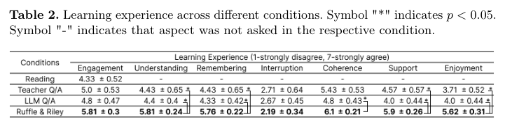
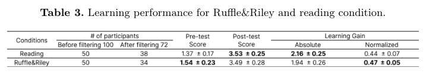
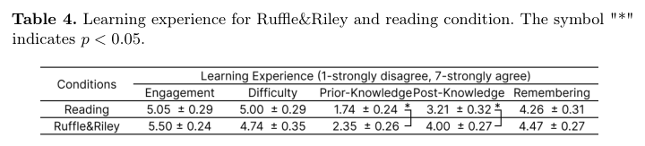
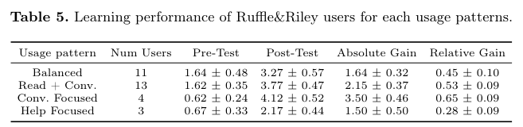
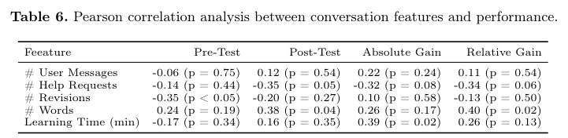

# 표 목록 — Ruffle&Riley: Insights from Designing and Evaluating a Large Language Model-Based Conversational Tutoring System

> 자동 생성. PNG가 정본이고 markdown은 검색·인용 보조용(열이 어긋날 수 있음).

## Table 1 (p.8)

_markdown 자동 추출 실패(이미지 표이거나 선 없는 표). PNG를 보고 필요한 값만 리뷰에 옮길 것_

## Table 2 (p.8)

_markdown 자동 추출 실패(이미지 표이거나 선 없는 표). PNG를 보고 필요한 값만 리뷰에 옮길 것_

## Table 3 (p.9)

_markdown 자동 추출 실패(이미지 표이거나 선 없는 표). PNG를 보고 필요한 값만 리뷰에 옮길 것_

## Table 4 (p.9)

_markdown 자동 추출 실패(이미지 표이거나 선 없는 표). PNG를 보고 필요한 값만 리뷰에 옮길 것_

## Table 5 (p.10)

markdown: [table5.md](table5.md)

## Table 6 (p.11)

markdown: [table6.md](table6.md)

