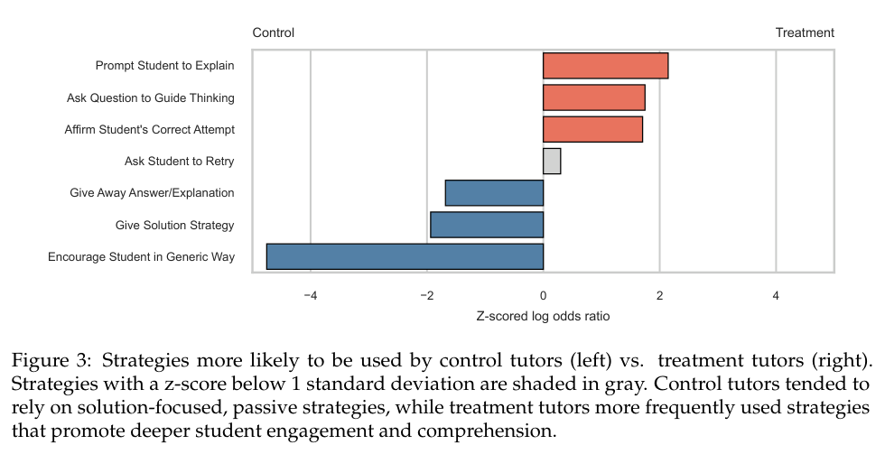
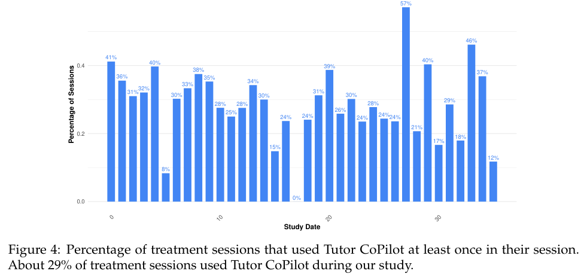
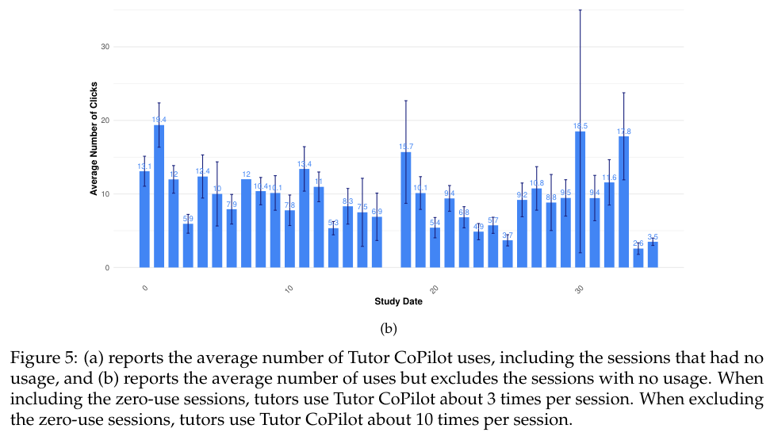
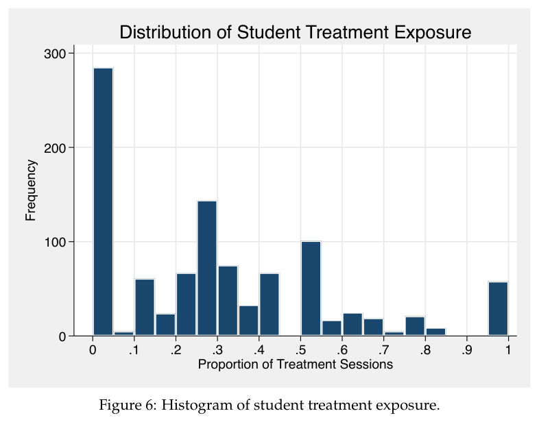

# 그림 목록 — Tutor CoPilot: A Human-AI Approach for Scaling Real-Time Expertise

> 자동 생성(llmwiki extract). 원문 PDF 캡처 · 로컬 연구용. 캡션은 원문 그대로.

## Figure 1 (p.5)

*Figure 1: Illustration of Tutor CoPilot. (a) Tutor CoPilot is integrated into live contexts as a button which the tutor can activate for real-time assistance during their tutoring sessions. (b) Tutor CoPilot applies user safety and privacy practices, such as automatically de-identifying student and tutor names and limiting the amount of user information sent to external LM services. (c) Tutor CoPilot generates expert-like guidance by leveraging the Bridge method (Wang et al., 2024a) which captures expert decision-making from their verbalized reasoning patterns. (d) Tutor CoPilot enables user customization. The tutor can customize the guidance by editing (*

## Figure 2 (p.11)

*Figure 2: Heterogeneity analysis by tutor initial effectiveness on student learning. (a) reports by the tutor’s initial quality rating and (b) by tutor’s tutoring experience.*

## Figure 3 (p.11)

*Figure 3: Strategies more likely to be used by control tutors (left) vs. treatment tutors (right). Strategies with a z-score below 1 standard deviation are shaded in gray. Control tutors tended to rely on solution-focused, passive strategies, while treatment tutors more frequently used strategies that promote deeper student engagement and comprehension.*

## Figure 4 (p.22)

*Figure 4: Percentage of treatment sessions that used Tutor CoPilot at least once in their session. About 29% of treatment sessions used Tutor CoPilot during our study.*

## Figure 5 (p.24)

*Figure 5: (a) reports the average number of Tutor CoPilot uses, including the sessions that had no usage, and (b) reports the average number of uses but excludes the sessions with no usage. When including the zero-use sessions, tutors use Tutor CoPilot about 3 times per session. When excluding the zero-use sessions, tutors use Tutor CoPilot about 10 times per session.*

## Figure 6 (p.31)

*Figure 6: Histogram of student treatment exposure.*

