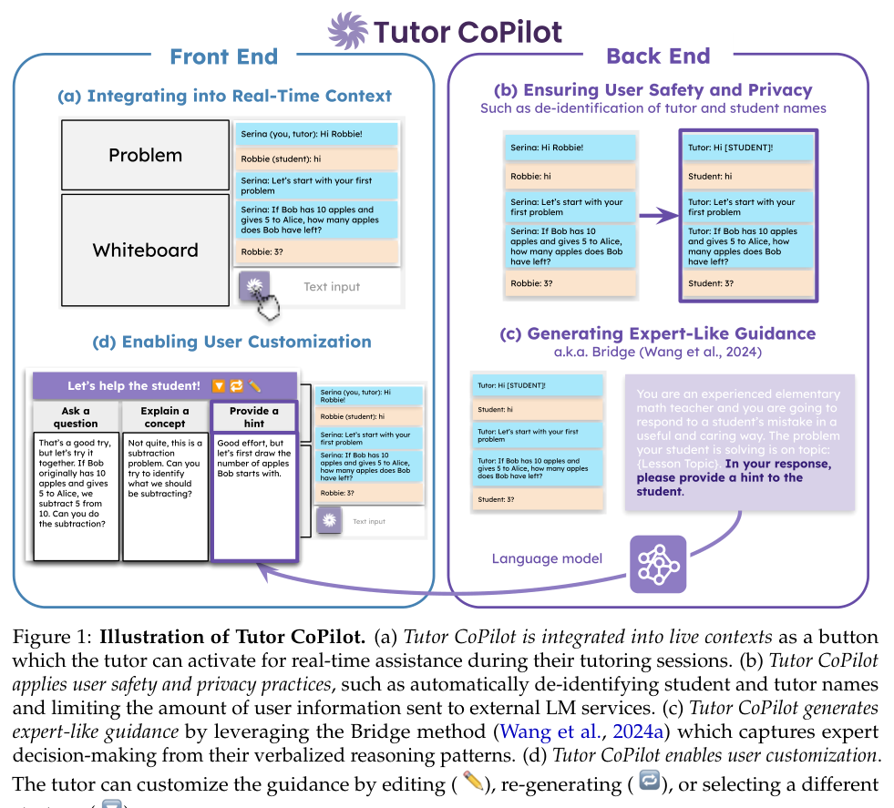
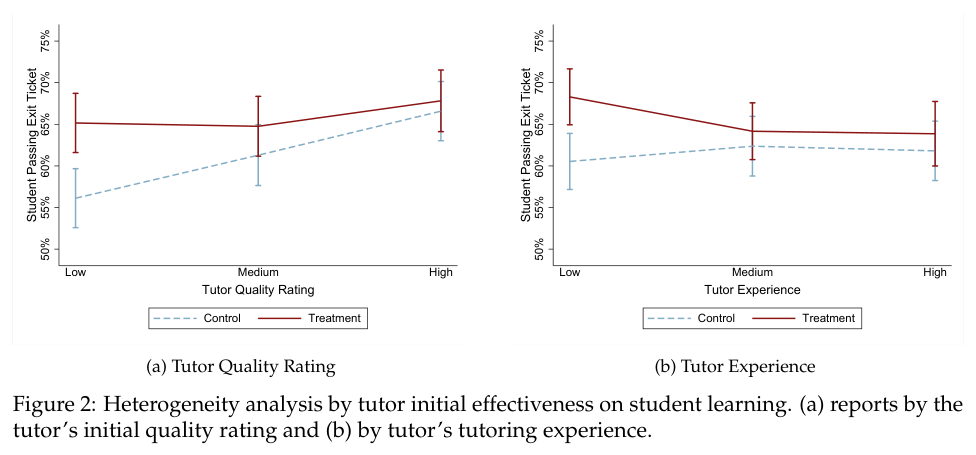

# Tutor CoPilot: A Human-AI Approach for Scaling Real-Time Expertise

> **저자**: Rose E. Wang, Ana T. Ribeiro, Carly D. Robinson, Susanna Loeb, Dora Demszky | **날짜**: 2024-10-03 | **URL**: <https://arxiv.org/abs/2410.03017> (DOI 후보 10.21203/rs.3.rs-5363154/v1 — Crossref 제목 일치로 찾은 Research Square 판본, 확인 필요)
> **자료**: [추출 원문](source.md) · [그림 목록](figures/figures.md) · [표 목록](tables/tables.md) — 원문 PDF는 Zotero/로컬 보관

---

## Essence

*Figure 1: Illustration of Tutor CoPilot …* — 원문 PDF 캡처 · 로컬 연구용 (arXiv CC BY 4.0)
- 무엇이 보이는가: 왼쪽 Front End(튜터링 화면 안의 버튼, 전략 선택·편집 UI), 오른쪽 Back End(이름 비식별화, Bridge 기반 제안 생성).
- 어떻게 읽을까: AI가 학생과 직접 말하지 않고, 튜터가 버튼을 눌러 받은 제안을 고르고 고쳐 보낸다.
- 텍스트만 읽으면 놓치는 것: 한 번에 여러 전략(질문하기·개념 설명·힌트)의 제안을 나란히 보여 튜터의 선택권을 남긴다는 점.

초보 튜터가 수업 중 버튼을 누르면 전문가 의사결정 모델(Bridge)로 만든 제안을 받는 Human-AI 시스템을 실제 온라인 튜터링에 넣고, 사전등록 RCT로 학생 숙달률이 4%p 오르고 저평가 튜터에서 9%p 올랐음을 보였다 [근거: 2024-wang-tutor-copilot-human-ai-approach · p.1].

## Motivation

- **Known**: 초보 교육자를 전문가 지도로 훈련하면 효과적이지만 비싸고(교사당 연 $3,300 이상) 실제 수업 시간과 분리되어 있다 [근거: 2024-wang-tutor-copilot-human-ai-approach · p.1–2].
- **Gap**: 웹 데이터로 학습된 LM은 실제 K-12 상호작용과 달라 정답을 알려 주는 등 나쁜 교수 반응을 내기 쉽고, fine-tuning·prompting은 전문가의 잠재 추론을 담지 못한다 [근거: 2024-wang-tutor-copilot-human-ai-approach · p.2; p.4].
- **Why**: 경험 없는 교육자에게 배우는 경우가 많은 소외 지역 학생이 가장 큰 피해를 본다 [근거: 2024-wang-tutor-copilot-human-ai-approach · p.1–2].
- **Approach**: AI가 학생을 직접 가르치지 않고, 상황 지식을 가진 인간 튜터에게 전문가 같은 제안을 실시간으로 주는 Human-AI 협업으로 접근했다 [근거: 2024-wang-tutor-copilot-human-ai-approach · p.2].

## Achievement

*Figure 2: Heterogeneity analysis by tutor initial effectiveness on student learning.* — 원문 PDF 캡처 · 로컬 연구용 (arXiv CC BY 4.0)
- 무엇이 보이는가: 튜터 품질 평가(a)·경력(b)의 하·중·상 집단별 exit ticket 통과율, Control(점선)과 Treatment(실선).
- 어떻게 읽을까: 낮은 집단일수록 두 선의 간격이 크고, 높은 집단에서는 거의 겹친다.
- 텍스트만 읽으면 놓치는 것: 저평가 튜터 + CoPilot 집단이 고평가 튜터 control 집단과 비슷한 수준까지 올라온다는 시각적 비교.

1. **학생 숙달률 향상**: ITT 분석에서 CoPilot을 받은 튜터의 학생이 주제를 숙달(exit ticket 통과)할 확률이 4%p 높았다(p<0.01) [근거: 2024-wang-tutor-copilot-human-ai-approach · p.1; Table 2].
2. **덜 숙련된 튜터에 더 큰 효과**: 저평가 튜터 9%p(56%→65%), 저경력 튜터 7%p(61%→68%) 상승 [근거: 2024-wang-tutor-copilot-human-ai-approach · p.10, Figure 2].
3. **교수 전략 변화**: 550,000+ 메시지 분류 결과, 학생 설명 유도·안내 질문 같은 고품질 전략을 더 쓰고 정답을 알려 주는 일은 줄었다 [근거: 2024-wang-tutor-copilot-human-ai-approach · p.1; p.10].
4. **저비용**: 사용량 기준 튜터당 연 $20 [근거: 2024-wang-tutor-copilot-human-ai-approach · p.1].

## How

- 기존 연구 Bridge를 활용: 경험 많은 교사의 think-aloud 데이터에서 전문가 의사결정을 추출해 LM 지시문으로 바꾼다 [근거: 2024-wang-tutor-copilot-human-ai-approach · p.4].
- 시스템: 실시간 대화 맥락 통합, 학생·튜터 이름 비식별화, 전략별 제안 생성, 편집·재생성·전략 변경 [근거: 2024-wang-tutor-copilot-human-ai-approach · p.5–6].
- 설계: FEV Tutor와 미국 남부 학군(Title I 학교 9곳)이 참여한 2개월 RCT(2024년 3월 말 시작), 튜터를 무작위 배정, OSF 사전등록 [근거: 2024-wang-tutor-copilot-human-ai-approach · p.2; p.6].
- 분석: 학생 공변량과 학급 고정효과를 넣은 ITT 회귀(RQ1), 튜터 품질·경력 삼분위 상호작용(RQ2), 고/저품질 전략 분류기(RQ3), 튜터 인터뷰(RQ4) [근거: 2024-wang-tutor-copilot-human-ai-approach · p.8].
- 데이터: 4,136 세션, 550,000+ 채팅 메시지, 2,000+ CoPilot 사용 기록 [근거: 2024-wang-tutor-copilot-human-ai-approach · p.7].

## Originality

- 실시간 라이브 튜터링에서 Human-AI 시스템을 평가한 첫 RCT라고 주장한다 [근거: 2024-wang-tutor-copilot-human-ai-approach · p.2].
- AI가 학생을 직접 가르치는 대신 **인간 튜터의 역량을 키우는** 방향: 인간의 맥락 지식과 LM의 전문가 제안을 결합 [근거: 2024-wang-tutor-copilot-human-ai-approach · p.2].
- 효과를 학습 결과뿐 아니라 대화 언어(교수 전략)의 변화로 측정했다.

## Limitation & Further Study

- (저자) 미국 남부 학군의 소외 지역(다수 히스패닉) 학생과 초보 튜터 대상이라 다른 집단·국가로의 일반화가 불확실하다 [근거: 2024-wang-tutor-copilot-human-ai-approach · p.12].
- (저자) 근접 성과(exit ticket)는 올랐지만 학년말 수학 시험 점수에서는 유의한 향상이 없었고, 2개월이라는 짧은 기간이 원인일 수 있다 [근거: 2024-wang-tutor-copilot-human-ai-approach · p.12].
- (저자) 채팅 기반 플랫폼만 다뤘다; 화이트보드·음성 같은 다른 modality와 안전장치가 과제로 남았다 [근거: 2024-wang-tutor-copilot-human-ai-approach · p.12–13].
- (저자) 튜터는 제안이 학년 수준에 맞지 않거나 "너무 똑똑하다"고 지적했다 [근거: 2024-wang-tutor-copilot-human-ai-approach · p.12].
- (저자) 후속: 실시간 지도로 얻은 기술이 얼마나 유지되는지, 다른 과목·연령으로 확장 [근거: 2024-wang-tutor-copilot-human-ai-approach · p.13].
- (리뷰어) 튜터 단위 무작위 배정이라 학생 노출량 변이가 작다; 저자도 학생 무작위 배정을 제안한다 [근거: 2024-wang-tutor-copilot-human-ai-approach · p.12].

## Evaluation

- Novelty: 4/5
- Technical Soundness: 5/5
- Significance: 5/5
- Clarity: 4/5
- Overall: 5/5

**총평**: 대규모 사전등록 RCT로 "AI가 교사를 대체"가 아니라 "AI가 초보 교사를 끌어올림"의 효과를 보여 준 교육 AI의 기준점이 될 연구다.

## Related Papers

<!-- llmwiki:related:start -->
_자동 계산(llmwiki related): 어휘 유사도 + 저자·연도 규칙. 의미 해석은 아래 '에이전트 해석'에 근거와 함께._

- 🔄 다른 접근: [Ruffle&Riley: Insights from Designing and Evaluating a Large Language Model-Based Conversational Tutoring System](../2024-schmucker-ruffle-riley-insights-designing/review.md) — TF-IDF 유사도 0.14 · BM25 1위 · 같은 해
- 🔄 다른 접근: [Practical and Ethical Challenges of Large Language Models in Education: A Systematic Scoping Review](../2023-yan-practical-ethical-challenges-large/review.md) — TF-IDF 유사도 0.05 · BM25 2위 · 1년 앞선 연구
<!-- llmwiki:related:end -->

### 에이전트 해석
- 🔄 [Ruffle&Riley](../2024-schmucker-ruffle-riley-insights-designing/review.md)는 LLM 에이전트가 학습자와 직접 대화하는 반대 설계이며, 온라인 성인 표본에서 학습 성과 차이를 찾지 못했다. 두 결과를 함께 보면 "누가 LLM과 대화하는가"가 설계 변수다 (가설) [근거: 2024-schmucker-ruffle-riley-insights-designing · Achievement; 2024-wang-tutor-copilot-human-ai-approach · Achievement].
- 🧪 [Yan et al.](../2023-yan-practical-ethical-challenges-large/review.md)이 요구한 실제 교육 현장 검증·투명성에 대한 대규모 응답 사례로 읽을 수 있다 [근거: 2023-yan-practical-ethical-challenges-large · Limitation & Further Study].
