# 표 목록 — Tutor CoPilot: A Human-AI Approach for Scaling Real-Time Expertise

> 자동 생성. PNG가 정본이고 markdown은 검색·인용 보조용(열이 어긋날 수 있음).

## Table 1 (p.9)

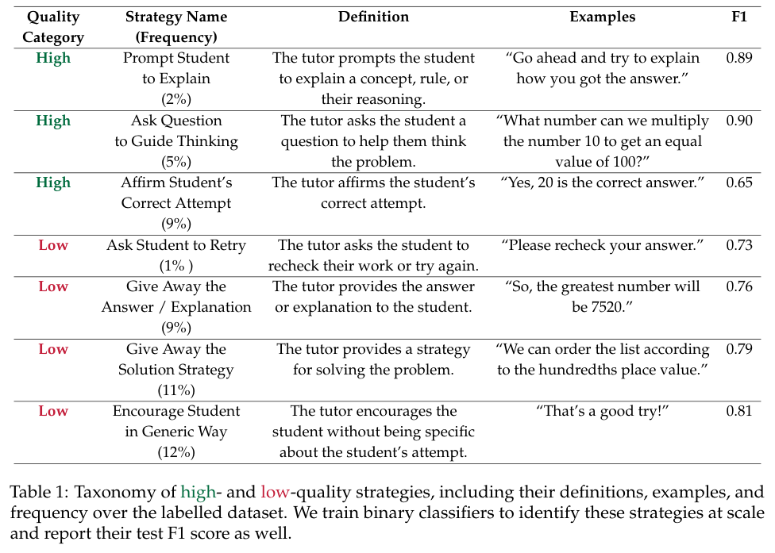

markdown: [table1.md](table1.md)

## Table 2 (p.10)

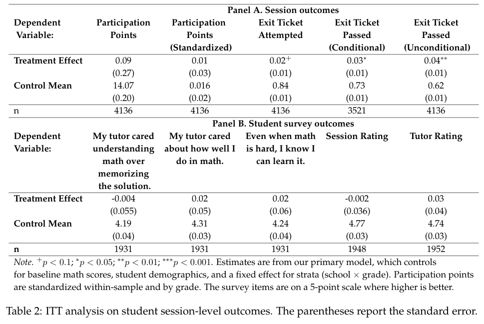

markdown: [table2.md](table2.md)

## Table 3 (p.19)

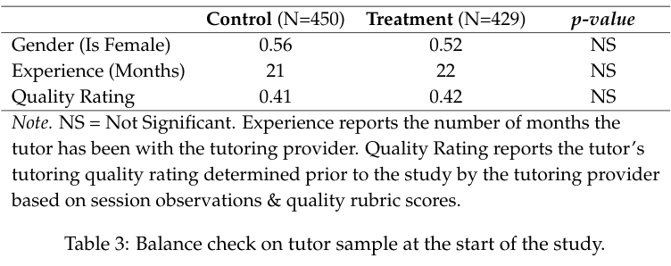

markdown: [table3.md](table3.md)

## Table 4 (p.19)

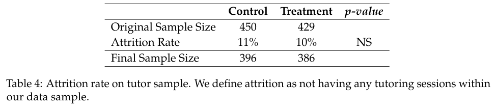

markdown: [table4.md](table4.md)

## Table 5 (p.20)

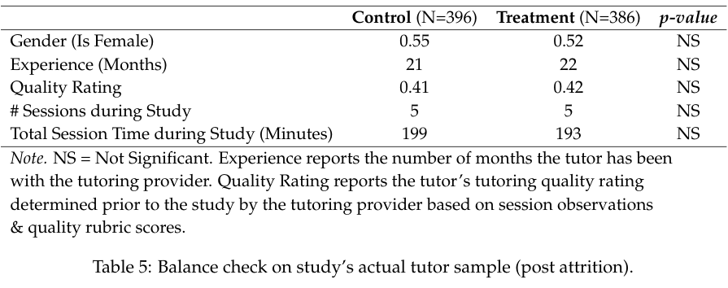

markdown: [table5.md](table5.md)

## Table 6 (p.21) ⚠️ 자동 크롭 신뢰도 낮음 — PNG 확인

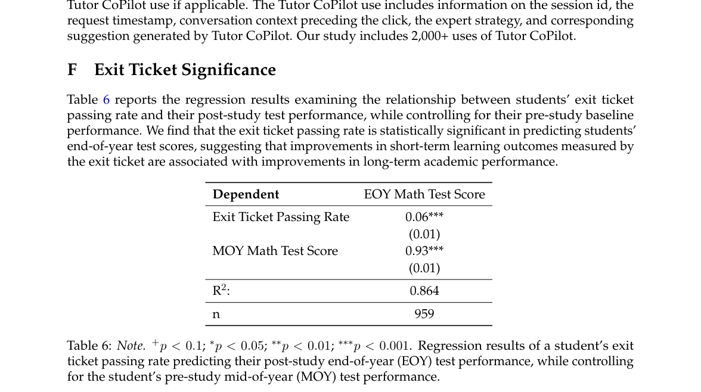

markdown: [table6.md](table6.md)

## Table 7 (p.22)

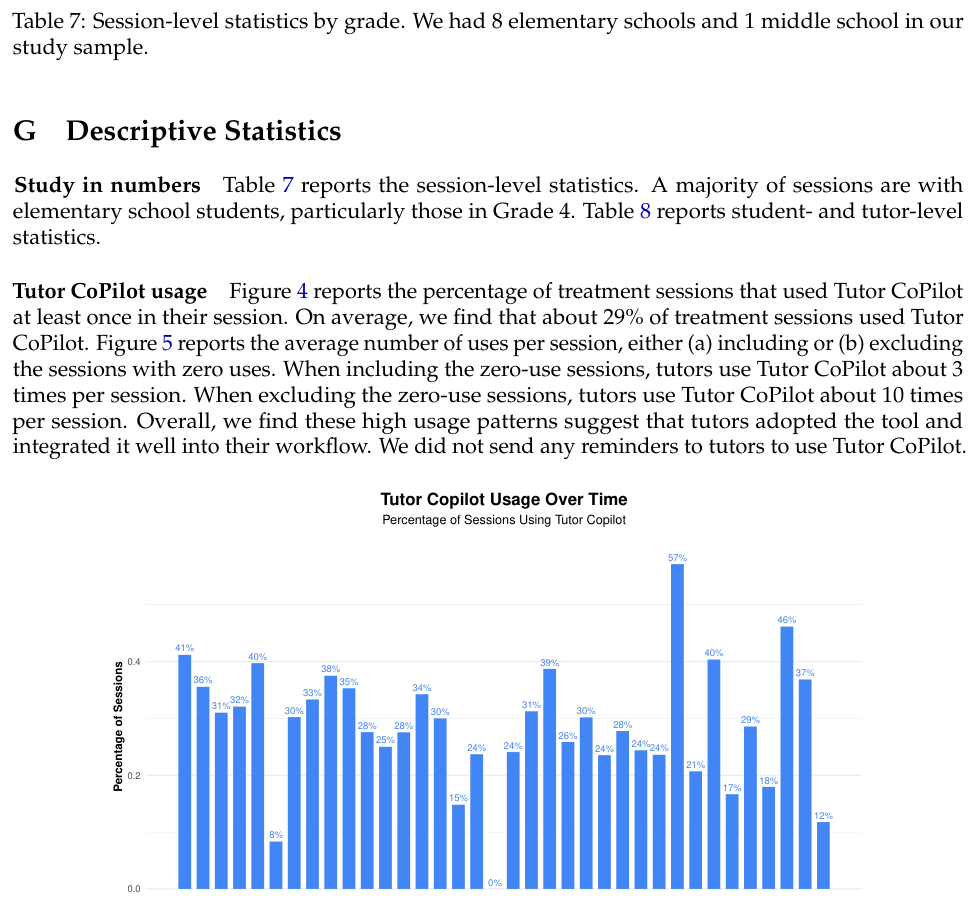

markdown: [table7.md](table7.md)

## Table 8 (p.23)

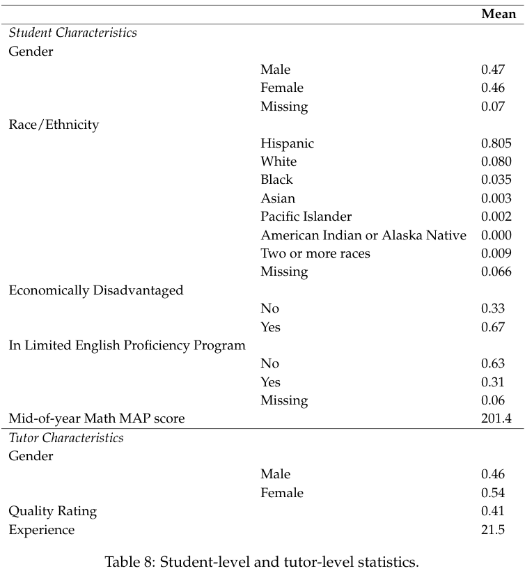

markdown: [table8.md](table8.md)

## Table 9 (p.25)

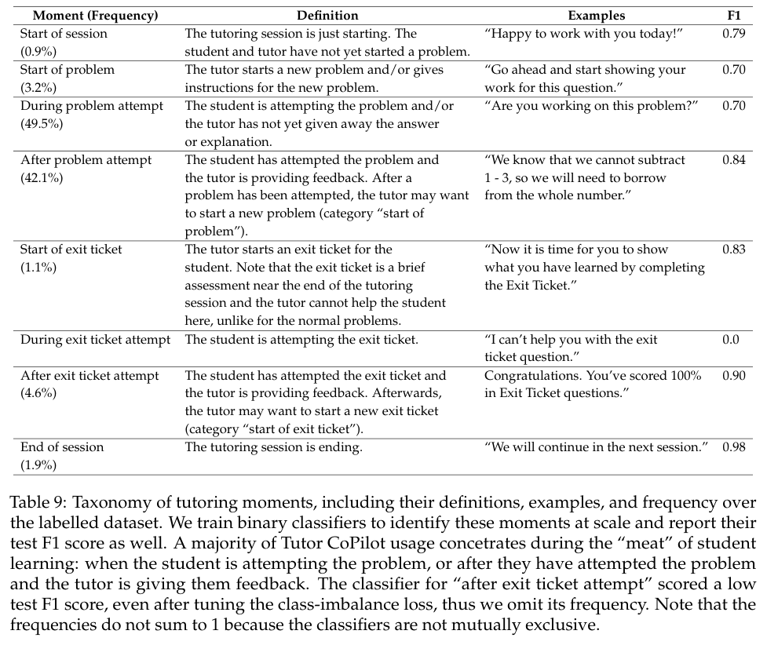

markdown: [table9.md](table9.md)

## Table 10 (p.26)

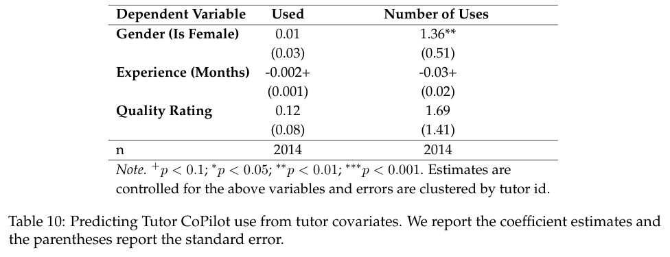

markdown: [table10.md](table10.md)

## Table 11 (p.27)

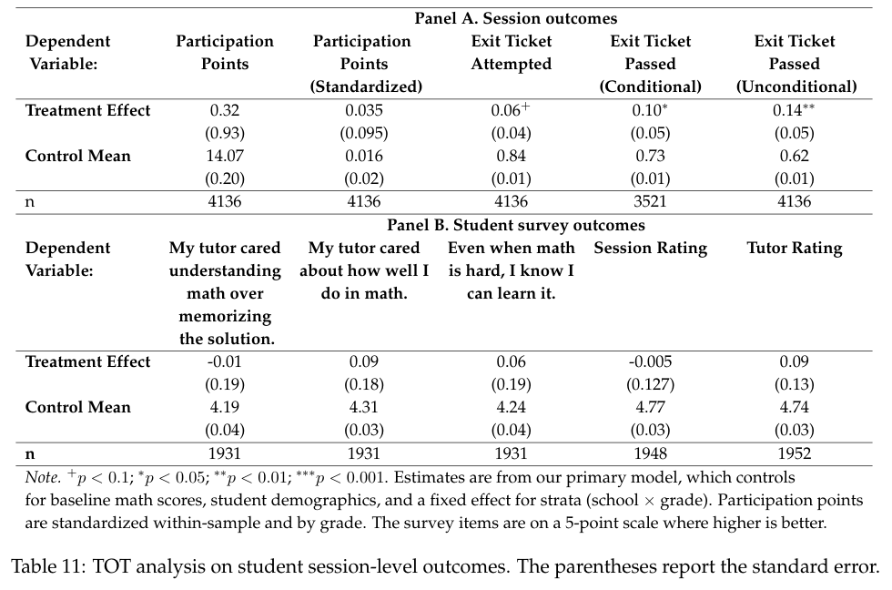

markdown: [table11.md](table11.md)

## Table 12 (p.32)

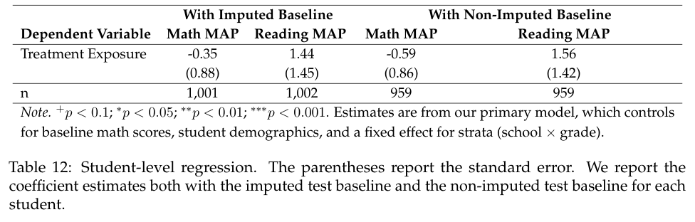

markdown: [table12.md](table12.md)

## Table 13 (p.32)

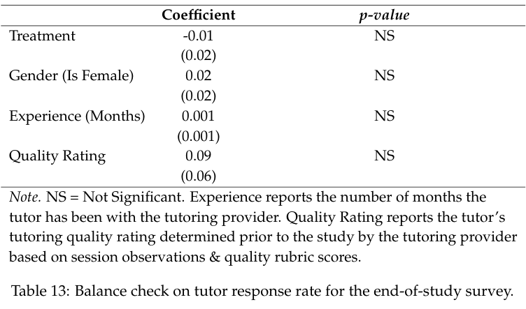

markdown: [table13.md](table13.md)

## Table 14 (p.33)

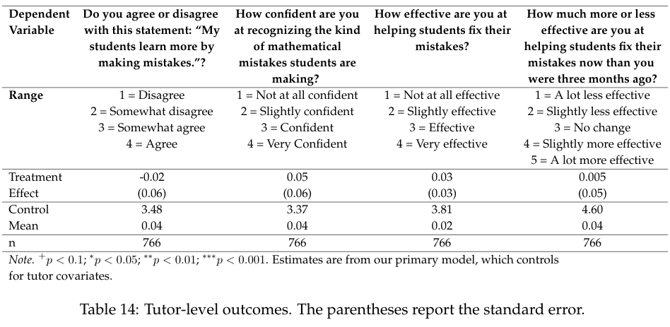

markdown: [table14.md](table14.md)

